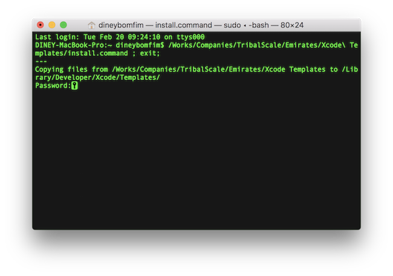
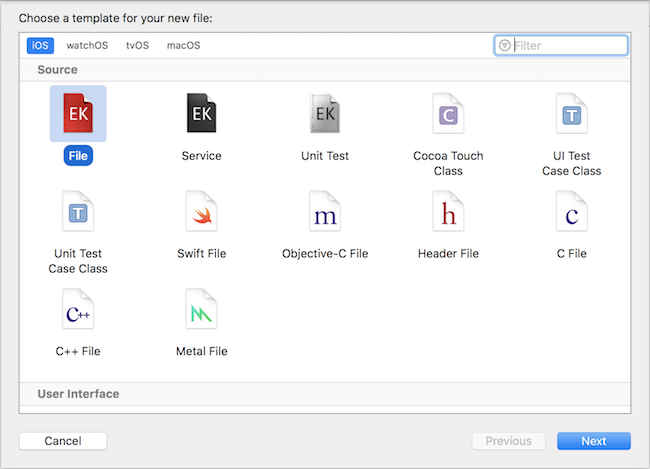

# Xcode Templates & Tooling

## Description

This is part of the [iOS Best Practices and Guidelines](best-practices.md) document, check it for further details. The **Xcode Templates & Tooling** will help you to install:

- Xocde Templates
- Xcode Code Snippets
- Xcode Key Bindings (shortcuts)

## Installing / Updating

Double click on `install.command` file and enter your **machine admin password**.
The installation process will copy and paste files in the right folders in order to have a local copy in the file system.

## File Templates

Just create all new files using one of the templates on Xcode.

## Code Snippets

Also some code snippets will be added to your local Xcode.

Shortcut | Level | Description
------- | -------- | -----
mark-extension | Top | Creates a new extension mark
describe-context-it | Function | Creates a "describe-context-it" case for BDD syntax

## Key Bindings (Shortcuts)

Also some Key Bindings are added to the Xcode to facilitate the daily work.

Shortcut | Keys | Description
------- | -------- | -----
⌥⇧S | option + shift + s | Sort the files in the Project Navigator by name (alphabetically)

## FAQ

> Is it automatically updated?

- No. As a different GIT repo, you have to pull the changes to your local machine and run the `install.command` in order to update this tooling package.

> Do I need to restart Xcode or the machine?

- Nothing is needed in order to get the Xcode Templates working. But for snippets and shortcuts you need to restart the Xcode.
